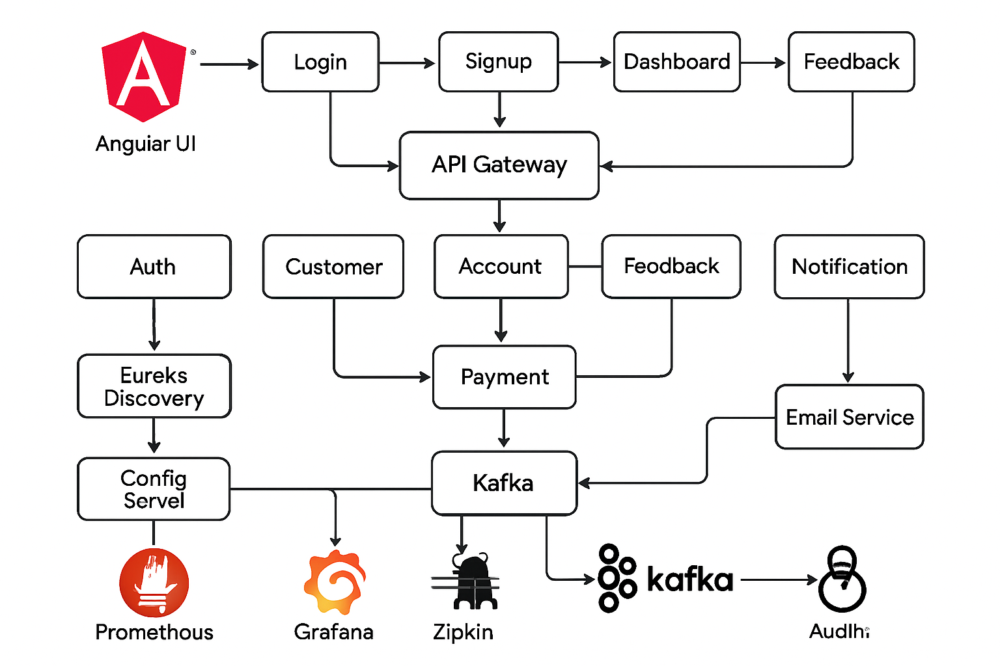

# 🏦 Banking Web Application (Capstone Project)

This project is a **Banking Web Application** designed using **Angular** for the frontend and **Spring Boot Microservices** for the backend. It demonstrates a **modern enterprise-level architecture** with features like customer management, accounts, payments, notifications, auditing, and feedback.  

---

## 🚀 Features

- **Angular Frontend**
  - User authentication (Login & Signup)
  - Secure token-based communication
  - Separate **Admin** and **User** components
  - Responsive UI

- **Spring Boot Microservices**
  - **Auth Service**: Handles login, registration, JWT authentication
  - **Customer Service**: Manages customer profiles and KYC details
  - **Account Service**: Stores account data (balances, types, etc.)
  - **Payment Service**: Fund transfers & workflows
  - **Audit Service**: Logs all critical actions & transactions
  - **Feedback Service**: Stores customer feedback
  - **Notification Service**: Sends email alerts & notifications

- **Service Management**
  - **API Gateway**: Single entry point, request routing, load balancing
  - **Discovery Server (Eureka)**: Service registry & discovery
  - **Config Server**: Centralized configuration management

- **Event & Communication**
  - **Kafka & Zookeeper**: Asynchronous communication (Payment → Notification)
  - **Feign Clients**: Inter-service communication

- **Monitoring & Documentation**
  - **Swagger**: API documentation
  - **Zipkin**: Distributed tracing
  - **Prometheus & Grafana**: Monitoring and dashboards

---

## 🏗️ Architecture

The system follows a **Microservices Architecture**:

1. Angular frontend communicates with backend through **API Gateway**.  
2. Gateway forwards requests to respective services (Customer, Payment, etc.).  
3. **JWT authentication** ensures secure transactions.  
4. **Kafka events** are used for asynchronous notifications.  
5. **Audit logs** are stored for compliance and security.  

---

## 📂 Tech Stack

- **Frontend**: Angular, Bootstrap  
- **Backend**: Spring Boot (Java), Spring Security, JPA, 
- **Messaging**: Apache Kafka, Zookeeper  
- **Database**: MySQL  
- **Service Management**: Eureka, Config Server, API Gateway  
- **Monitoring**: Prometheus, Grafana, Zipkin  
- **Build Tools**: Maven   
- **Version Control**: Git & GitHub  

---

## 🔑 Setup & Run

### Prerequisites
- Node.js & Angular CLI  
- Java 17+  
- Maven / Gradle  
- MySQL Database  
- Apache Kafka & Zookeeper  

### Steps
1. Clone the repository:
   ```bash
   git clone https://github.com/uttamkumarnarra/banking-app.git
   cd banking-app
Start backend services:

Run Config Server, Discovery Server, and API Gateway.

Run microservices: Auth, Customer, Account, Payment, Audit, Feedback, Notification.

Start Kafka & Zookeeper:

zookeeper-server-start.sh config/zookeeper.properties
kafka-server-start.sh config/server.properties


Setup frontend (Angular):

cd frontend
npm install
ng serve -o

📊 Screenshots

Home Page

Signup


Login
 
 

📖 Conclusion

This project successfully demonstrates the implementation of a secure, scalable, and maintainable banking application using Angular and Spring Boot Microservices. It applies real-world enterprise concepts like service discovery, API gateway, distributed tracing, and event-driven communication.

✨ Author

Uttam Kumar Narra
📧 uttamnarra1@gmail.com

🔗 LinkedIn : https://www.linkedin.com/in/uttam-kumar-narra-54145024b/
| GitHub : https://github.com/Narra-Uttam-Kumar